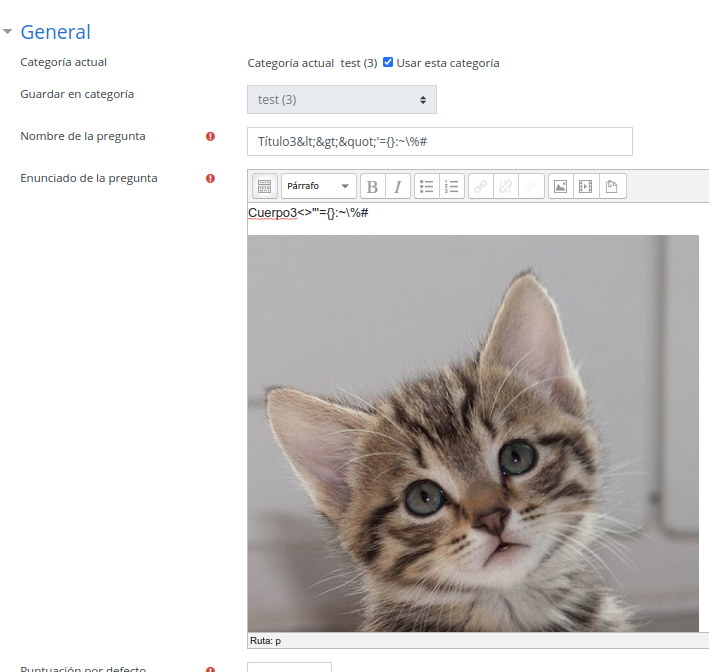

# TXT a Moodle

Herramienta para poder configurar de forma sencilla preguntas Moodle.

Las preguntas podrán contener código fuente ya que **escapa** los caracteres **HTML** y los caracteres **especiales de Moodle**.

También tiene la posibilidad de poder subir **capturas de pantalla** de forma cómoda. Estas imágenes están referenciadas en el fichero de texto (tercera línea de cada pregunta)

El fichero de preguntas sigue este esquema (Ejemplo en ```ejemplo.txt```):

```
Título1
Cuerpo1
RutaImg1
OpciónA
OpciónB
OpciónC
OpciónD
---------------------- Línea que se ignora
Título2
Cuerpo2

OpciónA
OpciónB
OpciónC
OpciónD
---------------------- Línea que se ignora
Título3
Cue...
```

Ejecución:

```
[folen:~/Workspace … ls/txt-to-gift] main(+0/-7)* ±
>./txt-to-gift.py
usage: simple_example [-h] categoria fichero_preguntas
simple_example: error: the following arguments are required: categoria, fichero_preguntas
```

Para generar el fichero GIFT (Luego se importa en Moodle):

```
[folen:~/Workspace … ls/txt-to-gift] main(+0/-7)* 2 ±
>./txt-to-gift.py test ejemplo.txt > ejemplo.gift
```

Ahora podrás importar el fichero Moodle sin problema.


